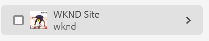

# AEM Authoring Guide

Welcome to the AEM Authoring Guide. This comprehensive resource is designed to help you master the fundamentals of Adobe Experience Manager (AEM) authoring. From launching your AEM instance to navigating through the interface, understanding the structure, and creating your own custom templates and components, this guide covers all the essentials.

## Getting Started

### 1. Setting Up Your Development Environment

To begin, ensure you have a well-prepared development environment. Follow these steps:

1. Create a designated folder for your AEM project.
2. Download the **[aem-guides-wknd.all-2.1.4 and wknd](../files/)** zip file.
3. Extract the contents of the **[wknd](../files/)** zip file into your designated folder, resulting in this file structure:

```
wknd
  + aem-guides-wknd
    + (... all the files required for development)
  . .DS_Store
```

4. Move the **aem-guides-wknd** folder out of the **wknd** folder, then delete any unnecessary files or folder. Your setup is now ready.

### 2. Installing Packages

1. Launch your AEM instance (**aem-author-p4502**), which will direct you to the AEM login page.
2. Enter your admin credentials: `Username: admin, Password: admin`.
3. Navigate to **`Tools`** > **`General`** > **`CRXDE Lite`**. For now, focus on CRXDE Lite as you will learn the other items later on.
   
4. Head to the **Package** section and select **Upload Package**.
   
   
5. Browse your files and upload the **`aem-guides-wknd.all-2.1.4.zip`** package.
   
6. Finally, go to **`Navigation`** > **`Sites`** to find the **`WKND`** site, which you can use for practice.
   
   
   

Congratulations! You've successfully set up your AEM localhost for authoring. Familiarize yourself with the environment before delving into the basics.

## Next Steps

Ready for the next stage? Move on to [The Basics](./basics.md), where we'll explore foundational concepts to help you become proficient in AEM authoring.
