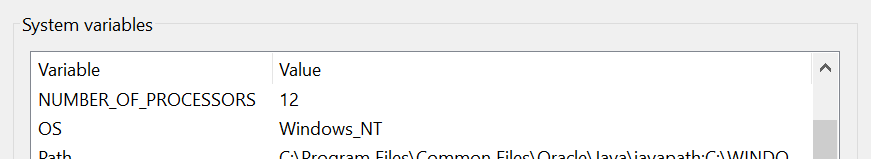
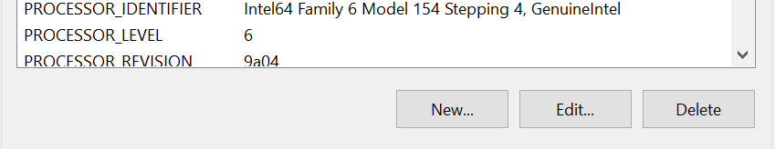
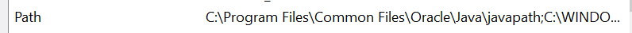

# Installation Steps

Follow these steps to install the required software:

**Java JDK:** Adobe Experience Manager is built on Java. Ensure you have Java Development Kit (JDK) installed. Make sure that your download the **JDK 11** version from [Oracle JDK Downloads](https://www.oracle.com/java/technologies/javase-downloads.html) or you can use OpenJDK.

1. Download and install the appropriate Java Development Kit (JDK) version.
2. After Installing the JDK, proceed to setting up your Local Environtment:

   - Open Windows Start then search `"Environment Variable"` and click the `"Edit the system environment variables"`<br><br>
   - In the `System Variables`, click the `New...` button then input these values

     - `Variable name: JAVA_HOME, Variable value: C:\Program Files\Java\jdk-11`

     

     

   - After creating new variable under `System Variables` find the `Path Variable` then open it
     
     - Click on the `New` button then add these values:
       - `%JAVA_HOME%\bin`
         <br><br>

3. Verify the installation by running the following command in your terminal:

```
java -version
```

**Next Step:**

[Code Editor Installation](./code-editor.md)
<br><br><br><br>
_Go back [installation.md](../installation.md)_
