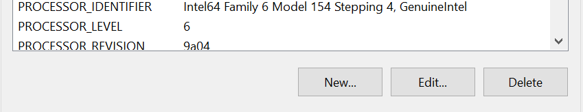

# Installation Steps

Follow these steps to install the required software:

**Maven Plugin:** Maven is used to build and manage projects in Adobe Experience Manager. Please make sure to download the **Latest Version** of Maven.

1. Download the `Binary zip archive: apache-maven-${newest version}.bin.zip` on the Official [Apache Maven Website](https://maven.apache.org/download.cgi).
2. After Installing the Maven Zip, proceed to setting up your Local Environtment:

   - Open Windows Start then search `"Environment Variable"` and click the `"Edit the system environment variables"`<br><br>
   - In the `System Variables`, click the `New...` button then input these values

     - `Variable name: MAVEN_HOME, Variable value: C:\Program Files\Maven\apache-maven-${version you downloaded}`

     

     

   - After creating new variable under `System Variables` find the `Path Variable` then open it
     
     - Click on the `New` button then add these values:
       - `%MAVEN_HOME%\bin`
         <br><br>

3. Verify the installation by running the following command in your terminal:

```
mvn -v
```

**Next Step:**

[Java Installation](./java.md)
<br><br><br><br>
_Go back [installation.md](../installation.md)_
